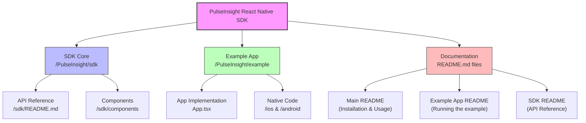

# PulseInsight React Native SDK

React Native SDK for integrating PulseInsights surveys into mobile applications.

## Getting Started

This repository contains both the SDK for integration into your own apps and a complete example application that demonstrates proper implementation.

### For Beginners (New to React Native)
If you're new to React Native or mobile development:

1. **Start with the Example App**: Explore the example application in the `/PulseInsight` directory first
2. Follow the setup instructions in [PulseInsight/README.md](PulseInsight/README.md) to run the example
3. Examine how the SDK is implemented in `/PulseInsight/example/App.tsx`

### For Experienced Developers
If you're familiar with React Native and just want to integrate the SDK:

1. Follow the installation steps below
2. Review the usage examples in this README
3. Refer to the full API documentation in [PulseInsight/sdk/README.md](PulseInsight/sdk/README.md)

### Repository Structure

The following diagram shows the organization of this repository:



## Installation

### npm
```bash
npm install pulse-insight-react-native
```

### yarn
```bash
yarn add pulse-insight-react-native
```

## iOS Setup

### One-Step Installation
```bash
cd ios && pod install
```

That's it! The PulseInsightsSPM iOS SDK is now automatically included via CocoaPods.

## Android Setup

Android setup is automatically handled through auto-linking. You'll need to add the PulseInsights Maven repository to your project.

### Add Maven Repository

In your project's root `build.gradle` file (or `settings.gradle` for newer projects), add the PulseInsights Maven repository:

```gradle
// For build.gradle
allprojects {
    repositories {
        // ... other repositories
        maven {
            url "https://pi-sdk.s3.us-east-1.amazonaws.com/android"
        }
    }
}

// OR for settings.gradle (newer projects)
dependencyResolutionManagement {
    repositories {
        // ... other repositories
        maven {
            url "https://pi-sdk.s3.us-east-1.amazonaws.com/android"
        }
    }
}
```

The SDK dependency will be automatically linked:

```gradle
dependencies {
    // Auto-linked by React Native
    // implementation 'com.pulseinsights:android-sdk:2.4.4'
}
```

## Example Application

For a complete implementation example of the Pulse Insight React Native SDK, please refer to the example application in the `/PulseInsight` directory.

To run and understand the example application:

1. Follow the detailed setup instructions in [PulseInsight/README.md](PulseInsight/README.md)
2. Examine the implementation in `/PulseInsight/example/App.tsx`
3. Reference the API documentation in [PulseInsight/sdk/README.md](PulseInsight/sdk/README.md)

The example demonstrates all aspects of SDK integration including initialization, survey triggering, context data management, and best practices for real-world implementation.

> **Note:** Before running the example, you'll need to configure it with your account details as described in [PulseInsight/README.md](PulseInsight/README.md).

## Usage

### Basic Integration

```javascript
import { PulseInsight } from 'pulse-insight-react-native';

// Initialize the SDK
const pulseInsight = new PulseInsight({
  accountId: 'YOUR_ACCOUNT_ID',
  enableDebugMode: true,  // Set to false in production
  customData: { 'user_type': 'premium', 'age': '30' }  // Optional custom data
});

// Initialize the SDK (typically in componentDidMount or useEffect)
await pulseInsight.initialize();

// Set the survey host URL
pulseInsight.setHost('survey.pulseinsights.com');

// Set the current view name (call this when navigating between screens)
pulseInsight.setViewName('home_screen');

// Trigger survey scan
pulseInsight.serve();
```

### Advanced Features

```javascript
// Present a specific survey by ID
pulseInsight.presentSurvey('SURVEY_ID');

// Check if a survey has been answered
const answered = await pulseInsight.isSurveyAnswered('SURVEY_ID');

// Set context data for targeting (merges with existing data)
pulseInsight.setContextData({ 'location': 'store', 'product_viewed': 'shoes' }, true);

// Clear all context data
pulseInsight.clearContextData();

// Reset device identifier (clears survey history)
pulseInsight.resetUdid();
```

For more detailed examples and a complete implementation, see the [Example App](PulseInsight/example/App.tsx) in the SDK repository.

## Expo Support

- **❌ Managed Workflow**: Not supported (requires development build)
- **✅ Development Build**: Supported
- **✅ Standard React Native**: Fully supported

## Troubleshooting

### iOS

#### Build Issues
- Make sure iOS deployment target is 14.0 or higher
- Verify Swift version is 5.0+
- Run `pod cache clean --all && pod install` if you encounter module issues
- Do NOT manually add PulseInsights as an SPM package in Xcode

### Android

#### Maven Repository
- Ensure auto-linking is enabled
- Check that Android SDK is properly configured
- If you see "Could not find com.pulseinsights:android-sdk", verify you've added the Maven repository as shown in the Android Setup section

#### AndroidManifest Conflicts
If you see errors like:
```
Attribute application@allowBackup value=(false) is also present at [com.pulseinsights:android-sdk:2.4.4] AndroidManifest.xml value=(true).
Attribute application@theme value=(@style/AppTheme) is also present at [com.pulseinsights:android-sdk:2.4.4] AndroidManifest.xml value=(@style/Theme.Surveysdk).
```

Add a `tools:replace` directive in your app's AndroidManifest.xml:

```xml
<manifest xmlns:android="http://schemas.android.com/apk/res/android"
    xmlns:tools="http://schemas.android.com/tools"
    package="com.yourapp">

    <application
        android:allowBackup="true"
        android:theme="@style/AppTheme"
        tools:replace="android:allowBackup,android:theme"
        ...>
        
        <!-- Your activities and other components -->
        
    </application>
</manifest>
```

#### Apache HTTP Legacy Library
If you encounter `java.lang.NoClassDefFoundError: Failed resolution of: Lorg/apache/http/HttpResponse`, add the Apache HTTP legacy library to your AndroidManifest.xml:

```xml
<application
    ...
    >
    
    <!-- Required for Pulse Insights SDK on API level 28+ -->
    <uses-library
        android:name="org.apache.http.legacy"
        android:required="false" />
        
    <!-- Your activities and other components -->
    
</application>
```

This is required because Android 9 (API level 28) and higher removed some Apache HTTP classes that the SDK depends on.

#### JVM Target Version Inconsistency
While our SDK no longer enforces specific Java/Kotlin versions (as of v0.1.16), you might still encounter JVM target inconsistency errors due to other libraries or your project configuration. If you see "Inconsistent JVM-target compatibility detected", ensure your app's Kotlin and Java compilation targets are consistent with each other:

```gradle
android {
    // Other configurations...
    
    compileOptions {
        // Use whatever Java version your project requires
        // Just make sure both sourceCompatibility and targetCompatibility use the same version
        sourceCompatibility JavaVersion.VERSION_1_8  // Or VERSION_11, VERSION_17, etc.
        targetCompatibility JavaVersion.VERSION_1_8  // Must match sourceCompatibility
    }
    
    kotlinOptions {
        // Must match the Java version above
        jvmTarget = "1.8"  // Or "11", "17", etc. (matching your Java version)
    }
}
```

The key is consistency between Java and Kotlin targets, not the specific version used.

## Contributing

See [CONTRIBUTING.md](CONTRIBUTING.md) for guidelines.

## License

MIT License - see [LICENSE](LICENSE) file for details.